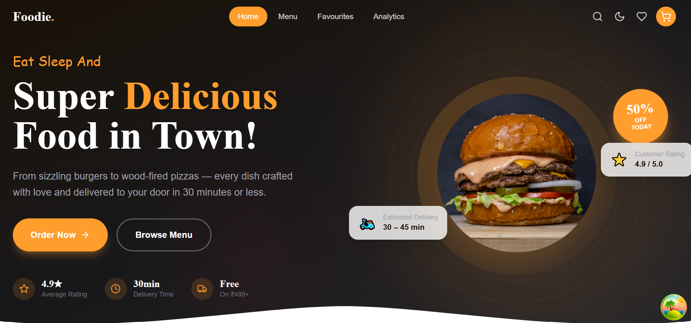
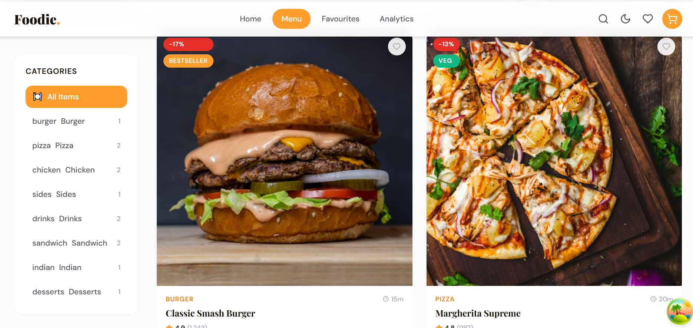

# 🍔 Foodie — Full-Stack Food Ordering Platform

<p align="center">
  A production-grade food ordering platform built with <b>React + Vite</b> and <b>Express.js</b>.<br/>
  Designed to showcase real-world full-stack architecture, scalable code, and premium UI/UX.
</p>

<p align="center">
  
  
  
  
</p>

---

## 📌 Table of Contents

* [✨ Overview](#-overview)
* [🚀 Live Demo](#-live-demo)
* [🔥 Key Highlights](#-key-highlights)
* [🧩 Features](#-features)
* [🏗 Architecture](#-architecture)
* [🗂 Project Structure](#-project-structure)
* [⚙️ Tech Stack](#️-tech-stack)
* [📡 API Endpoints](#-api-endpoints)
* [🛠 Getting Started](#-getting-started)
* [🏭 Production Build](#-production-build)
* [📸 Screenshots](#-screenshots)
* [📈 Portfolio Value](#-portfolio-value)
* [🤝 Contributing](#-contributing)
* [👨‍💻 Author](#-author)

---

## ✨ Overview

**Foodie** is a modern **full-stack food ordering application** that replicates real-world e-commerce behavior.

It demonstrates:

* Clean separation of frontend & backend
* Scalable architecture with modular design
* Advanced UI/UX with animations and responsiveness
* Efficient state and server-state management


---

## 🔥 Key Highlights

* ⚡ Full-stack architecture (React + Express)
* 🧠 Redux Toolkit for global state management
* 🔄 TanStack Query for server-state caching & syncing
* 🎨 Premium UI with TailwindCSS + animations
* 📦 Modular and scalable folder structure
* 🚀 One-command concurrent startup

---

## 🧩 Features

### 🎯 Frontend

* 🌓 Dark / Light mode (persistent)
* 🎞 Animated page transitions (Framer Motion)
* ⚡ Lazy loading & code splitting
* 🛒 Cart drawer with real-time updates
* 💳 Checkout with form validation
* ❤️ Wishlist system
* 🔍 Advanced filtering, sorting & search
* 📊 Analytics dashboard (Recharts)
* 📱 Fully responsive with mobile navigation
* 🔔 Toast notifications system
* 🎯 Scroll-based animations & interactions

### ⚙️ Backend

* 🔗 RESTful API architecture
* 🧱 MVC pattern (Controllers / Routes / Middleware)
* 📁 JSON-based mock database
* 🔍 Filtering, sorting, and searching APIs
* 📦 Order management system
* ⭐ Reviews system
* 🛡 Security middleware (CORS, Helmet)
* 📊 Request logging (Morgan)
* ❗ Global error handling

---

## 🏗 Architecture

```text
Client (React + Vite)
        ↓
Redux Toolkit (State)
        ↓
TanStack Query (API Layer)
        ↓
REST API (Express.js)
        ↓
JSON Data Store
```

---

## 🗂 Project Structure

```bash
food-app/
├── client/                     # React + Vite frontend
│   └── src/
│       ├── components/
│       ├── pages/
│       ├── layouts/
│       ├── hooks/
│       ├── store/
│       ├── services/
│       └── utils/
│
├── server/                     # Express backend
│   ├── controllers/
│   ├── routes/
│   ├── middleware/
│   ├── data/
│   └── server.js
│
├── package.json
└── README.md
```

---

## ⚙️ Tech Stack

### Frontend

| Technology      | Purpose             |
| --------------- | ------------------- |
| React 18 + Vite | Fast UI development |
| TailwindCSS     | Modern styling      |
| Redux Toolkit   | Global state        |
| TanStack Query  | API handling        |
| React Hook Form | Form validation     |
| Framer Motion   | Animations          |
| Recharts        | Analytics UI        |

### Backend

| Technology        | Purpose       |
| ----------------- | ------------- |
| Node.js + Express | API server    |
| JSON Data         | Mock database |
| CORS + Helmet     | Security      |
| Morgan            | Logging       |

---

## 📡 API Endpoints

| Method | Endpoint                | Description    |
| ------ | ----------------------- | -------------- |
| GET    | `/api/health`           | Health check   |
| GET    | `/api/foods`            | Fetch foods    |
| GET    | `/api/foods/:id`        | Food details   |
| GET    | `/api/foods/categories` | Categories     |
| GET    | `/api/foods/popular`    | Popular foods  |
| GET    | `/api/foods/featured`   | Featured items |
| POST   | `/api/orders`           | Create order   |
| GET    | `/api/orders/:id`       | Get order      |
| GET    | `/api/reviews`          | Fetch reviews  |

---

## 🛠 Getting Started

### 1️⃣ Install dependencies

```bash
npm run install:all
```

### 2️⃣ Run development servers

```bash
npm run dev
```

### 3️⃣ Access the app

* Frontend → http://localhost:5173
* Backend → http://localhost:5000/api

---

## 🏭 Production Build

```bash
npm run build
```

> Configure Express to serve the frontend `dist` folder in production.

---

## 📸 Screenshots





---

## 📈 Portfolio Value

This project highlights:

* 🧠 Full-stack system design
* ⚡ Performance optimization techniques
* 🧩 Clean and scalable architecture
* 🎨 UI/UX craftsmanship
* 📦 Production-level coding practices

---

## 🤝 Contributing

Contributions are welcome!

1. Fork the repository
2. Create a feature branch
3. Commit your changes
4. Open a Pull Request

---

## 👨‍💻 Author

**Vinayak**
🔗 GitHub: https://github.com/vinushinde2525-sys

---


